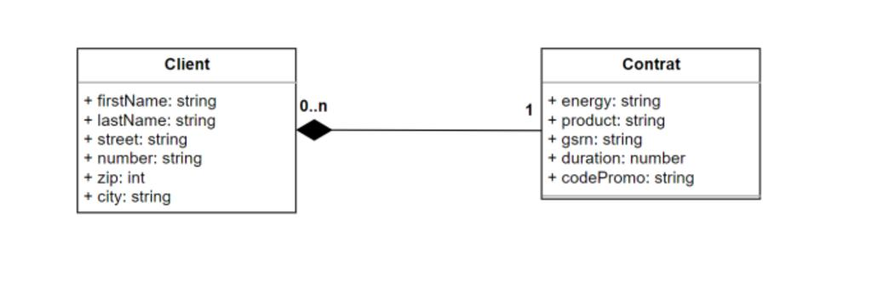

# Rest Api built with Lumen



You are able to

- Get the list of all clients
- Get one specific client
- Get all contracts specific to one client
- Update a contract

## Environment Setup

I used a boiler plate to create the environment for the project. Docker + Lumen with Nginx and MySQL.

## Routes

## How to use

Copy the project

```bash
git clone https://github.com/lalsdev/restAPI-lumen
```

Go in folder

```bash
cd restAPI-lumen
```

Build project

```bash
sudo docker-compose up --build -d
```

Enter the container

```bash
sudo docker-compose exec php sh
```

Exit current folder inside the container

```bash
cd ..
```

Download modules from composer

```bash
composer install
```

You should be able to access the routes

Stop container

```bash
sudo docker-compose down
```

### Get all clients

GET http://localhost:80/api/v1/clients

### Get one specific client

GET http://localhost:80/api/v1/clients/{client_id}

### Get all contracts from one client

GET http://localhost:80/api/v1/clients/{client_id}/contrats

### Update one or more attribute linked to one contract

PUT http://localhost:80/api/v1/contrats/{contrat_id}

There are other routes for the whole CRUD both for the clients and the contracts you can find the routes in app/routes/web.php

Bye!
